# Historical README and Stage Diary

This document preserves the former top-level README as a chronological
research record. Statements reflect the repository state when their sections
were written; use the current top-level `README.md`, `REPRODUCE.md`, and
`docs/reproducibility/FINAL_REPRODUCIBILITY_AUDIT.md` for current status.

# IDS2018 Validation-Safe Threshold Ablation

This repository publishes a clean, reproducible validation-safe refinement of the IDS2018 explainable threshold ablation experiment. The goal is methodological hygiene: use validation data for model and threshold selection, reserve the holdout set for final descriptive reporting, and preserve the original experiment lineage without redistributing raw CSE-CIC-IDS2018 data.

Original repository: https://github.com/themubasshir/ids2018-explainable-threshold-ablation

## Workflow

```mermaid
flowchart LR
  A["Processed CSE-CIC-IDS2018 binary dataset"] --> B["64/16/20 stratified split, seed 42"]
  B --> C["StandardScaler fit on training only"]
  C --> D["16-model validation baseline"]
  D --> E["Tune top five on training data"]
  E --> F["Validation threshold selection"]
  F --> G["Holdout-only final reporting"]
  G --> H["Dual-model SHAP on shared holdout sample"]
```



## Experiment Overview

- Dataset: rebalanced binary CSE-CIC-IDS2018 processed dataset.
- Records: 300,928 total, with 180,000 benign and 120,928 attack records.
- Predictors: 78 features; `Label` and `binary_label` are excluded from predictors.
- Split: 192,593 training records, 48,149 validation records, and 60,186 holdout test records.
- Random state: 42.
- Scaling: `StandardScaler` fit only on the training split.
- Baseline: 16 validation-evaluated models.
- Tuned top five: XGBoost, LightGBM, CatBoost, MLP, and 1D-CNN.


## Key Results

The balanced operating point is XGBoost Tuned at validation-selected threshold `0.51`. On the holdout test set it reached precision `0.9897505499134179`, recall `0.8743901430579675`, F1 `0.9285008671218141`, FPR `0.006083333333333333`, ROC-AUC `0.9801912125472036`, and PR-AUC `0.9776433333080397`.

The constrained-security operating point is LightGBM Tuned at validation-selected threshold `0.26`, selected by maximum validation F2 subject to FPR <= 5%. On the holdout test set it reached precision `0.9290071162317859`, recall `0.90680559001075`, F1 `0.9177721052851823`, F2 `0.9111605955862803`, FPR `0.04655555555555556`, and FN `2254`.


## Explainability

Dual-model SHAP uses an identical deterministic stratified holdout sample of 5,000 records: 2,500 benign and 2,500 attack. XGBoost and LightGBM share 15 of their top-20 features, with top-20 Jaccard similarity `0.6`, all-feature Spearman rank correlation `0.8540662778147889`, and p-value `2.839526154790284e-23`. The common top three features are `Init Fwd Win Byts`, `Fwd Seg Size Min`, and `Dst Port`.


## Journal-Extension Analyses

Stages 8-12 add journal-strengthening robustness and deployment analyses.

1. Bootstrap confidence: balanced XGBoost and LightGBM differences are statistically unresolved because all major paired confidence intervals include zero. See `docs/STATISTICAL_CONFIDENCE.md`.
2. Calibration: both selected models are reasonably calibrated, with no statistically resolved calibration winner and no recalibration performed. See `docs/CALIBRATION_ASSESSMENT.md`.
3. Operational cost: LightGBM security becomes preferable to LightGBM balanced when one missed attack costs more than `1.8407079646017699` false-positive investigations. See `docs/OPERATIONAL_COST_ANALYSIS.md`.
4. Attack categories: residual errors are concentrated mainly in `Infilteration` and `Brute Force -Web`; most DoS/DDoS and FTP brute-force categories reached 100% detection. See `docs/ATTACK_CATEGORY_ANALYSIS.md`.
5. Multi-seed robustness: XGBoost was selected for the balanced objective in `3/5` fixed-hyperparameter runs, and LightGBM was selected for the security objective in `4/5`. See `docs/MULTISEED_ROBUSTNESS.md`.


The cross-stage interpretation is summarized in `docs/JOURNAL_EXTENSION_SUMMARY.md`, and manuscript figure recommendations are listed in `figures/JOURNAL_FIGURE_INDEX.md`.

## Repository Structure

- `metadata/`: split metadata, feature names, scaler, checksums, environment details, and validation report.
- `results/baseline/`: 16-model validation ablation outputs.
- `results/tuning/`: top-five tuning outputs, probabilities, histories, parameters, and manifests.
- `results/threshold/`: validation threshold sweeps and operating-point selections.
- `results/holdout/`: final holdout summaries and probability files for selected objectives.
- `results/shap/`: SHAP top-feature tables and rank-comparison CSVs.
- `results/statistical_confidence/`: Stage 8 paired bootstrap confidence outputs.
- `results/calibration/`: Stage 9 calibration metrics, bins, and bootstrap intervals.
- `results/operational_cost/`: Stage 10 cost-ratio and break-even analyses.
- `results/attack_category/`: Stage 11 category-level detection and paired tests.
- `results/multiseed/`: Stage 12 fixed-hyperparameter multi-seed robustness outputs.
- `results/comparison/`: generated Markdown summaries from CSV artifacts.
- `models/`: portable top-five tuned model artifacts.
- `figures/` and `tables/`: publication figures and CSV/LaTeX tables.
- `docs/`: detailed protocol, comparison with the original repository, and exact result summary.
- `scripts/`: repository validation and generated-report utilities.

## Setup

Windows PowerShell:

```powershell
python -m venv .venv
.\.venv\Scripts\Activate.ps1
python -m pip install -r requirements.txt
python scripts\generate_comparison_report.py
python scripts\validate_repository.py
```

Linux/macOS:

```bash
python3 -m venv .venv
source .venv/bin/activate
python -m pip install -r requirements.txt
python scripts/generate_comparison_report.py
python scripts/validate_repository.py
```

## Kaggle Reproduction Notes

The archived experiment references `/kaggle/input/datasets/jmmubasshirrahman/ids2018-balanced-binary-dataset/merged_balanced_ids2018_safe.csv`. Place the processed dataset locally according to `DATASET.md` if you need to reproduce training, tuning, and threshold sweeps. Raw and processed dataset files are intentionally not redistributed in this repository.

## Limitations

This repository preserves exact archived metrics and artifacts, but it does not fabricate missing outputs. The copied notebook is the available Kaggle working notebook from the archive bundle; additional stage-specific notebooks were not present. Large raw SHAP matrices and oversized baseline joblib artifacts remain in the full archive rather than Git.

## Citation

If you use this repository, cite the CSE-CIC-IDS2018 dataset source and this validation-safe reproducibility repository. This work should be read as a methodological refinement, robustness analysis, and reproducibility extension of the original experiment.

<!-- BEGIN STAGE 13 LOCAL EXPLANATION RELIABILITY -->
## Stage 13: Local Explanation Reliability

The repository now includes an outcome-stratified local explanation
audit for the selected XGBoost and LightGBM models.

Key findings:

- TreeSHAP reconstructs both tree-model outputs to numerical precision.
- LIME feature rankings are comparatively repeatable across seeds.
- LIME stability does not imply local faithfulness.
- Only 2 of 64 representative LIME explanations satisfy all
  study-specific fidelity and TreeSHAP-agreement criteria.
- TreeSHAP is the primary local explanation method.
- LIME is reported as a supplementary surrogate-reliability stress test.

Detailed findings are available in
[`docs/STAGE13_LOCAL_EXPLANATION_RELIABILITY.md`](docs/STAGE13_LOCAL_EXPLANATION_RELIABILITY.md).
Publication tables are under `tables/lime/`, figures under
`figures/lime/`, detailed results under `results/lime/`, and
reproducibility artifacts under `metadata/lime/`.
<!-- END STAGE 13 LOCAL EXPLANATION RELIABILITY -->
<!-- BEGIN STAGES 14-22R RESEARCH EXTENSION STATUS -->

## Stages 14–22R Research Extension Status

The validation-safe journal extension now includes the later representation,
architecture, explainability, and source-faithful temporal-validation studies.

- **Stage 14:** neural Integrated Gradients reliability analysis.
- **Stage 15:** duplicate-safe Transformer ensemble feasibility experiment.
- **Stage 16:** frozen classical benchmark and same-holdout Transformer comparison.
- **Stage 17:** post-result Transformer attention stability analysis.
- **Stage 18:** representation-feasibility audit and source-restricted graph experiment.
- **Stage 19:** authentic multiscale causal temporal experiment.
- **Stage 20:** authentic packet-image construction and frozen masked-CNN comparator.
- **Stage 21:** parameter-matched CNN-versus-ViT ablation with preregistered post-result XAI.
- **Stage 22R:** Kaggle-faithful `{RANDOM, CHRONOLOGICAL} × {NATURAL, REBALANCED}`
  temporal-validation ablation under exact K79 identity control.

### Stage22R final status

Stage22R is scientifically closed at commit
`b5e44615269198426cc8a9aa3b3e701c2ca9e48e` and tag `stage22r-final-single-holdout-v1`.

The single Mar1–Mar2 final holdout opening is **1 / 1** and
**PERMANENTLY CLOSED**. The common K79-clean final evaluation set contains
**1,374,133** rows (998,788 benign; 375,345 attack). No retained-development
K79 signature exactly overlapped the final holdout.

On the shared final holdout, observed ranking performance was:

| Cell | PR-AUC | ROC-AUC |
|---|---:|---:|
| Random / Natural | 0.2630 | 0.5205 |
| Random / Rebalanced | 0.2733 | 0.5420 |
| Chronological / Natural | 0.6107 | 0.8064 |
| Chronological / Rebalanced | 0.6926 | 0.8322 |

These values are reported for all four frozen cells; **no post-holdout winner
was selected**. Frozen operating thresholds transferred poorly, demonstrating
a sharp distinction between ranking discrimination and deployment-threshold
behavior under forward temporal shift.


Manuscript-ready Stage22R text is in
[`docs/STAGE22R_MANUSCRIPT_INTEGRATION.md`](docs/STAGE22R_MANUSCRIPT_INTEGRATION.md),
with figure captions and the formal publication boundary in
[`docs/STAGE22R_PUBLICATION_FIGURES_AND_CLOSEOUT.md`](docs/STAGE22R_PUBLICATION_FIGURES_AND_CLOSEOUT.md).

The historical publication archive through Stage21 remains in
`docs/PUBLICATION_ARCHIVE_THROUGH_STAGE21.md`; the current figure index is
`figures/JOURNAL_FIGURE_INDEX.md`.

<!-- END STAGES 14-22R RESEARCH EXTENSION STATUS -->

<!-- BEGIN STAGE24 CROSS-DATASET SUMMARY -->

## Stage24 — Cross-Dataset Generalization

Stage24 is complete and scientifically closed.

The bidirectional audit evaluates CSE-CIC-IDS2018 and CICIDS2017 using frozen
feature bridges, extractor-semantic controls, source-only threshold selection,
and paired uncertainty analysis.

Frozen headline results:

- IDS2018 → CICIDS2017 bridge62:
  PR-AUC `0.667483`,
  ROC-AUC `0.733946`.
- CICIDS2017 → IDS2018 bridge62:
  PR-AUC `0.108176`,
  ROC-AUC `0.525167`.
- Reciprocal IDS2018 target prevalence:
  `0.104847`.
- Aggregate-flag serialization correction produced statistically resolved
  changes in primary bridge70 PR-AUC, ROC-AUC, and Brier score.
- Scientific fits: `4/4`.
- Evaluable target openings: `6/6`.
- GROUNDED_S4 cells cancelled before opening: `2`.
- Cancelled slots reallocated: `No`.

Publication and reproducibility package:

- `docs/STAGE24_MANUSCRIPT_INTEGRATION.md`
- `docs/STAGE24_PUBLICATION_TABLES.md`
- `docs/STAGE24_PUBLICATION_CLOSEOUT.md`
- `figures/stage24_cross_dataset/`
- `scripts/stage24/`

<!-- END STAGE24 CROSS-DATASET SUMMARY -->

<!-- STAGE25_PREVALENCE_OPERATIONAL_STRESS_CLOSEOUT -->
## Stage25 — Prevalence and Operational Stress Audit

**Status: SCIENTIFICALLY CLOSED**

Stage25 analytically translated 24 already-frozen Stage22/Stage24
operating points across six preregistered attack prevalences without
model refitting, new inference, target reopening, threshold tuning, or
calibration.

Key frozen outputs:

- 24 operating points
- 6 prevalence levels
- 144 Bayesian / traffic / SOC / relative-cost projections
- 120 exact PPV break-even calculations
- 720 required-FPR calculations
- 24 exact relative-cost break-even prevalences
- 5 preregistered figures (PNG + SVG)
- 7/7 preregistered sanity tests passed
- fixed reference scenario: 1,000,000 benign flows/day, 2 min/alert,
  analyst tiers 1/3/10, relative cost C_FP:C_FN = 1:100

The analysis demonstrates that benchmark precision and F1 do not directly
determine deployment PPV or SOC workload under rare attacks; very low FPR
is essential, capacity feasibility is distinct from detection usefulness,
and the Stage24 cross-dataset asymmetry persists under deployment-facing
translation.

Stage25-0 commit: `988fc5dd85018659749466ad9f8a1efcd5723ca9`  
Stage25-1 commit: `bfcc41741e055356c82f8f2f04042f3c2556b090`  
Stage25-2 commit: `e905a490aa6b7fdd3c22b021b11de270c9b57784`  
Stage25-3 commit: `5d1f9b2437ed7731f375acf01667c0faac57494e`  
Stage25-4 commit: `7820b9865a08f78107673207480c54d8dd0fe3eb`

Publication material is under:

- `results/stage25_prevalence_stress/stage25_publication_package/`
- `figures/stage25_prevalence_stress/`
- `docs/STAGE25_MANUSCRIPT_INTEGRATION.md`
- `scripts/stage25/`
